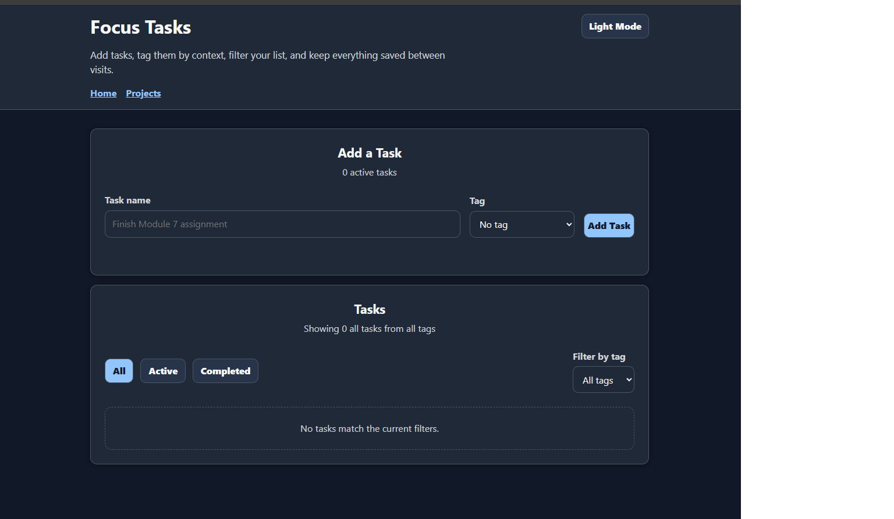

# LockIn - Giga Focus

## Description

This project is a responsive product landing page for a fictional productivity application called **LockIn - Giga Focus**. The goal of the page is to present a polished, professional layout while demonstrating advanced HTML, CSS, and JavaScript concepts.

The page includes a responsive navigation bar, hero section, feature cards, pricing options, customer reviews, and a footer. It was built with a mobile-first approach and uses CSS Grid, Flexbox, CSS variables, transitions, animation, and a persistent dark mode toggle.

## Project Links

- GitHub Repository: https://github.com/mgrowe/WebScripting
- Live GitHub Pages Site: https://mgrowe.github.io/WebScripting/advanced-product.html

## Features

- [x] Responsive product landing page layout
- [x] Mobile-first CSS design
- [x] CSS Grid used for major page sections
- [x] Flexbox used for the navigation bar and additional layout areas
- [x] Two responsive breakpoints for different screen sizes
- [x] Responsive navigation for mobile and desktop views
- [x] Hover transitions for buttons and cards
- [x] Simple page animation for added UI polish
- [x] CSS variables used for colors, spacing, and theme styling
- [x] Dark mode toggle button
- [x] Theme preference saved with localStorage
- [x] Single h1 used for accessibility
- [x] Visible keyboard focus styles
- [x] Readable color contrast in light and dark mode

## Screenshots

### Desktop View

### Mobile View

---

# To-Do List App

## Description

This project is a to-do list application that allows users to add, complete, delete, tag, and filter tasks. The app uses JavaScript and localStorage so tasks remain saved after the page is refreshed or reopened.

## Project Links

- GitHub Repository: https://github.com/mgrowe/WebScripting
- Live GitHub Pages Site: https://mgrowe.github.io/WebScripting/todo-app.html

## Features

- [x] Add a task with a required task name
- [x] Add an optional tag for each task
- [x] Display tasks in a list
- [x] Mark tasks as complete
- [x] Delete tasks
- [x] Filter tasks by All, Active, and Completed
- [x] Filter tasks by tag
- [x] Save tasks using localStorage
- [x] Reload saved tasks when the page opens
- [x] Show an error message for blank task names
- [x] Clear the form after adding a task
- [x] Show an active task counter
- [x] Includes dark mode support

## Screenshot

